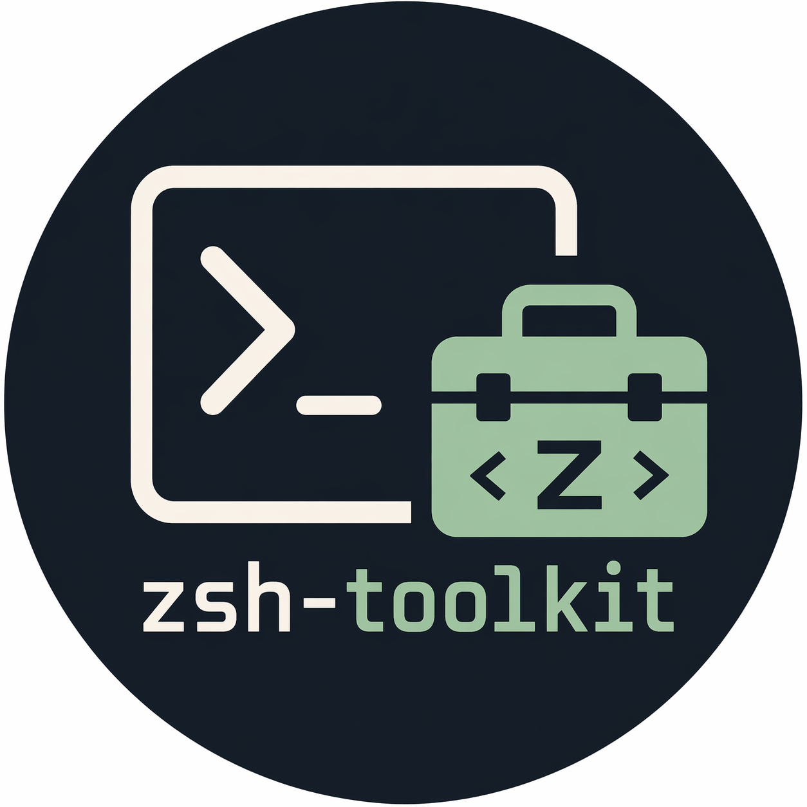

# zsh-toolkit

<p align="center">
  
</p>

A small Zsh toolkit you source from your existing `~/.zshrc`.

## Quick start

1. Clone the repo somewhere stable:
   ```sh
   git clone <repo-url> ~/Projects/zsh-toolkit
   ```
2. Install the required tools:
   ```sh
   ~/Projects/zsh-toolkit/scripts/install.sh
   ```
3. Add this near the end of your `~/.zshrc`:
   ```zsh
   source ~/Projects/zsh-toolkit/init.zsh
   ```
4. Create your personal override file:
   ```sh
   cp ~/Projects/zsh-toolkit/zsh/local.example.zsh ~/Projects/zsh-toolkit/zsh/local.zsh
   ```
5. Reload your shell:
   ```sh
   source ~/.zshrc
   ```

## How it works

- `init.zsh` loads the shared toolkit.
- `zsh/*.zsh` contains the tracked modules.
- `zsh/local.zsh` is your ignored personal file.

Keep reusable defaults in tracked modules. Keep personal aliases, PATH changes, secrets, and machine-specific settings in `zsh/local.zsh`.

## Personal overrides

`zsh/local.zsh` loads after the shared modules, so your local settings win.

```zsh
# zsh/local.zsh
export PATH="$HOME/.local/bin:$PATH"
alias gs='git status'
```

Editor-based helpers use `EDITOR`, then `VISUAL`, then `ZSH_TOOLKIT_EDITOR`, with `vi` as the fallback.

In the `til` and `todo` pickers, press `Ctrl-N` to create a new note from the current query.

## Modules

The default modules are:

- `shell`
- `tools`
- `git`
- `k8s`
- `til`
- `search`
- `ws`

If you want fewer modules, set this before sourcing `init.zsh`:

```zsh
typeset -ga ZSH_CONFIG_DISABLED_MODULES=(k8s ws)
source ~/Projects/zsh-toolkit/init.zsh
```

If you want full control, set the full list yourself:

```zsh
typeset -ga ZSH_CONFIG_MODULES=(shell tools git search)
source ~/Projects/zsh-toolkit/init.zsh
```

## Required tools

`scripts/install.sh` installs the shared toolchain with Homebrew:

- `fzf`
- `bat`
- `ripgrep`
- `tmux`
- `kubectl`
- `starship`
- `mise`
- `terraform`

The install script currently supports macOS + Homebrew only.
